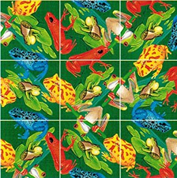

<!-- README.md is generated from README.Rmd. Please edit that file -->

```{r, echo = FALSE}
knitr::opts_chunk$set(
  collapse = TRUE,
  comment = "#>",
  fig.path = "README-"
)
```

# edger

```{r puzzle01, fig.cap='', out.width='30%', fig.asp=.75, fig.align='center', echo=FALSE}

```

The goal of edger is to ...

```{r puzzle02, fig.cap='', out.width='30%', fig.asp=.75, fig.align='center', echo=FALSE}
knitr::include_graphics("man/figures/IMG_20180624_214503455.jpg")
```

## Installation

You can install edger from github with:

```{r gh-installation, eval = FALSE}
# install.packages("devtools")
devtools::install_github("jsphdms/edger")
```

## Example

This is a basic example which shows you how to solve a common problem:

```{r example}
edger::edge_plot(tiles = list(c("green", "red", "yellow")
                         ,c("green", "yellow", "white")
                         ,c("white", "white", "blue")
                         ,c("blue", "black", "white")
                         ,c("white", "green", "red")
                         ,c("black", "green", "red")
                         ,c("green", "black", "black")

                         ,c("yellow", "green", "white")
                         ,c("blue", "yellow", "red")
                         ,c("green", "red", "black")
                         ,c("blue", "white", "blue")
                         ,c("white", "black", "blue")

                         ,c("red", "yellow", "white")
                         ,c("yellow", "black", "blue")
                         ,c("green", "yellow", "black")

                         ,c("green", "black", "red")))
```
