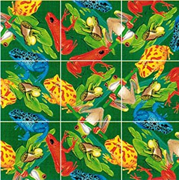

<!-- README.md is generated from README.Rmd. Please edit that file -->
edger
=====



The goal of edger is to ...


Installation
------------

You can install edger from github with:

``` r
# install.packages("devtools")
devtools::install_github("jsphdms/edger")
```

Example
-------

This is a basic example which shows you how to solve a common problem:

``` r
edger::edge_plot()
```


