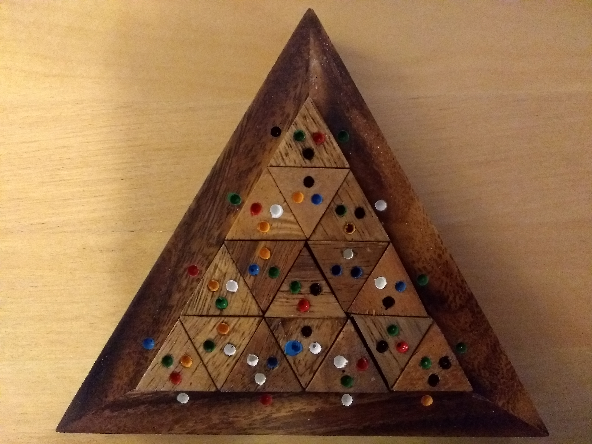
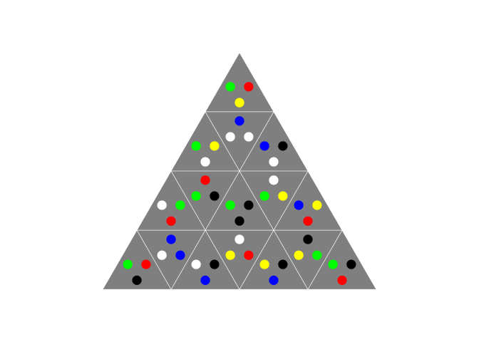

<!-- README.md is generated from README.Rmd. Please edit that file -->
edger
=====

Use edger to solve triangular edge matching puzzles using a [backtracking](https://en.wikipedia.org/wiki/Backtracking) algorithm. edger is inspired by a puzzle (pictured below) given to me by Tash and Stu; and [Ken Shirriff's article](http://www.righto.com/2010/12/solving-edge-match-puzzles-with-arc-and.html) on solving a similar puzzle with [Arc](https://en.wikipedia.org/wiki/Arc_(programming_language)).



There are many types of edge matching puzzles. Some parameters include: shape and number of tiles; the existence of edge constraints like those in the picture; and whether edges match symmetrically or asymetrically (e.g. matching colour to colour, or matching the head of a frog to it's legs). This package solves the puzzle pictured above, ignoring the edge constraints for simplicity. I might expand edger to solve a broader range of puzzles If I feel like it.

Installation
------------

Install edger from github with:

``` r
# install.packages("devtools")
devtools::install_github("jsphdms/edger")
```

Example
-------

Visually inspect solutions like so:

``` r
library(edger)
edge_plot(tiles = list(c("green", "red", "yellow")
                       ,c("green", "yellow", "white")
                       ,c("white", "white", "blue")
                       ,c("blue", "black", "white")
                       ,c("white", "green", "red")
                       ,c("black", "green", "red")
                       ,c("green", "black", "black")  # Bottom row

                       ,c("yellow", "green", "white")
                       ,c("blue", "yellow", "red")
                       ,c("green", "red", "black")
                       ,c("blue", "white", "blue")
                       ,c("white", "black", "blue")   # Second row up

                       ,c("red", "yellow", "white")
                       ,c("yellow", "black", "blue")
                       ,c("green", "yellow", "black") # Third row up

                       ,c("green", "black", "red")))  # Top row
```


